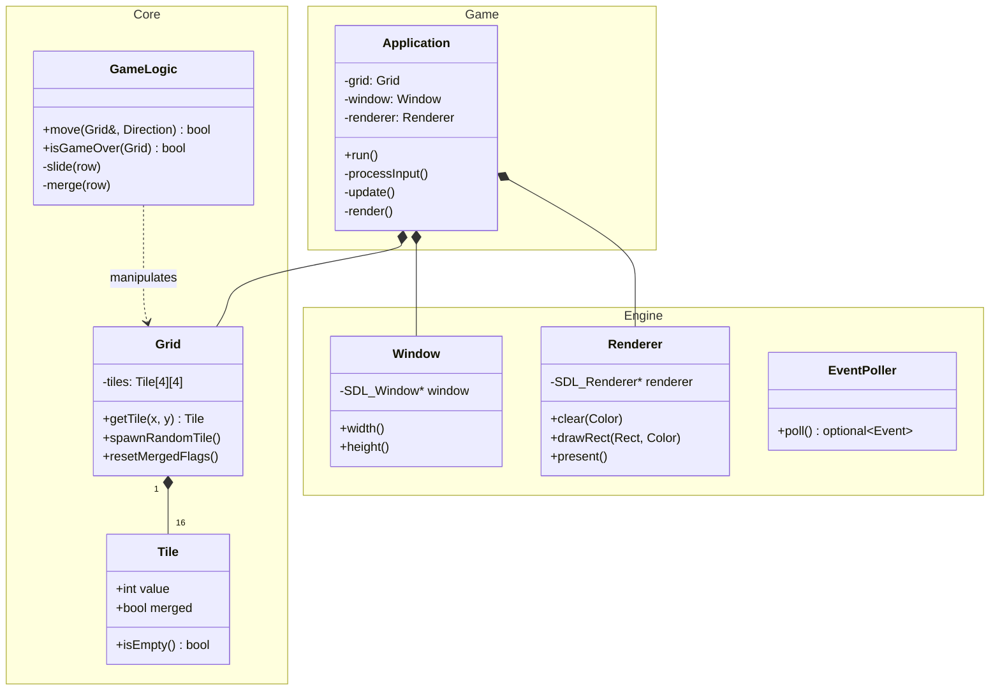

# Tile Twister - Architecture & Design

## 1. Architectural Philosophy
We follow a **Clean Architecture** approach with a strict **Model-View-Controller (MVC)** separation.
*   **Core (Model)**: Pure C++ logic. Knows *nothing* about SDL or rendering.
*   **Engine (View Wrapper)**: High-level C++ wrappers around low-level SDL C APIs.
*   **Game (Controller)**: The glue that binds input, logic, and rendering.

### Why this approach?
1.  **Testability**: We can test the entire game logic (merging, sliding, game over) without opening a window.
2.  **Portability**: The logic code is standard C++ and works on any machine.
3.  **Maintainability**: Changing the graphics library (e.g., SDL2 to SFML) only affects the `Engine` module, not the game rules.

---

## 2. Module Boundaries

### A. Core Module (`src/core/`)
**Responsibility**: Defines the state of the 2048 board and rules of the game.
**Dependencies**: standard library (`<vector>`, `<random>`, `<optional>`). **NO SDL**.

Key Components:
*   `Tile`: Represents a single cell (Value, MergedStatus).
*   `Grid`: A 4x4 matrix of Tiles. Handles "physical" storage.
*   `GameLogic`: Stateless functional helpers or state machine that executes moves (Left, Right, etc.) on a Grid.

### B. Engine Module (`src/engine/`)
**Responsibility**: RAII wrappers for SDL resources. Ensures no memory leaks.
**Dependencies**: `SDL2`.

Key Components:
*   `Window`: Owns `SDL_Window`. Destructor calls `SDL_DestroyWindow`.
*   `Renderer`: Owns `SDL_Renderer`. Provides drawing primitives (DrawRect, Clear, Present).
*   `Input`: Abstracts raw `SDL_Event` into game-semantic events (e.g., `AppQuit`, `KeyPressed`).

### C. Game Module (`src/game/`)
**Responsibility**: The Application Loop.
**Dependencies**: `Core`, `Engine`.

Key Components:
*   `Game`: The main class.
*   `InputHandler`: Translates `SDL_Keycode` -> `Direction`.

---

## 3. Class Diagram

---

## 4. Data Flow

### The Game Loop
1.  **Input**: The `Application` asks `EventPoller` for new events.
    *   *User presses 'Right Arrow'*.
2.  **Update**: `Application` calls `GameLogic::move(grid, Direction::Right)`.
    *   `GameLogic` iterates rows, slides empty spaces, finds adjacent equal tiles, merges them (doubling value), and sets `merged` flags.
    *   If `move` returns `true` (board changed), `Application` calls `Grid::spawnRandomTile()`.
3.  **Render**: `Application` clears the screen using `Renderer`.
    *   It iterates the `Grid`.
    *   For each `Tile`, it calculates the pixel position and specific color.
    *   Calls `Renderer::drawRect(...)`.
    *   Calls `Renderer::present()` to swap buffers.

## 5. Design Decisions & Rationale

### Value Semantics vs Pointers
We will use **Value Semantics** for `Tile` and `Grid`.
*   *Why?* A `Tile` is tiny (int + bool). Allocating it on the heap (`new Tile`) causes cache misses. Storing them in a contiguous array (`std::array<Tile, 16>`) is extremely CPU cache-friendly and avoids memory management headaches.

### RAII for SDL
We will use `std::unique_ptr` with custom deleters or dedicated wrapper classes for `SDL_Window` and `SDL_Renderer`.
*   *Why?* If `Game::run()` throws an exception, the stack unwinds, destructors run, and the window closes properly. No dangling resources.

## 6. Appendix: Clean Architecture Mapping
This project adapts **Robert C. Martin's (Uncle Bob) Clean Architecture** to a game context.

### The Dependency Rule
*Source code dependencies must point only inward, toward higher-level policies.*

| Clean Arch Layer | Concepts | Our Module | Description |
| :--- | :--- | :--- | :--- |
| **Entities** (Inner) | Enterprise Business Rules | `src/core/Tile`, `Grid` | The raw data structures. They don't know nothin' about sliding or merging, just data. |
| **Use Cases** | Application Business Rules | `src/core/GameLogic` | The rules of 2048. "If I move Left, tiles slide and merge." |
| **Adapters** | Interface Adapters | `src/engine/Input` | Converts "SDL_KEYDOWN" (Framework) to "Direction::Left" (Game). |
| **Frameworks** (Outer) | Frameworks & Drivers | SDL2, OpenGL, Hardware | The raw IO. We keep this at arm's length. |

**Benefit**: We can swap SDL2 for a Terminal UI (ncurses) by only rewriting the **Adapters** and **Frameworks** layers. The **Entities** and **Use Cases** (`src/core`) would remain 100% untouched.
