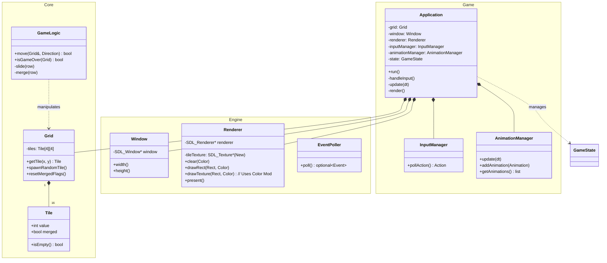

# Tile Twister - Architecture & Design

## 1. Architectural Philosophy
We follow a **Clean Architecture** approach with a strict **Model-View-Controller (MVC)** separation.
*   **Core (Model)**: Pure C++ logic. Knows *nothing* about SDL or rendering.
*   **Engine (View Wrapper)**: High-level C++ wrappers around low-level SDL C APIs.
*   **Game (Controller)**: The glue that binds input, logic, and rendering.

### Why this approach?
1.  **Testability**: We can test the entire game logic (merging, sliding, game over) without opening a window.
2.  **Portability**: The logic code is standard C++ and works on any machine.
3.  **Maintainability**: Changing the graphics library (e.g., SDL2 to SFML) only affects the `Engine` module, not the game rules.

---

## 2. Module Boundaries

### A. Core Module (`src/core/`)
**Responsibility**: Defines the state of the 2048 board and rules of the game.
**Dependencies**: standard library (`<vector>`, `<random>`, `<optional>`). **NO SDL**.

Key Components:
*   `Tile`: Represents a single cell (Value, MergedStatus).
*   `Grid`: A 4x4 matrix of Tiles. Handles "physical" storage.
*   `GameLogic`: Stateless functional helpers or state machine that executes moves (Left, Right, etc.) on a Grid.

### B. Engine Module (`src/engine/`)
**Responsibility**: RAII wrappers for SDL resources. Ensures no memory leaks.
**Dependencies**: `SDL2`.

Key Components:
*   `Window`: Owns `SDL_Window`. Destructor calls `SDL_DestroyWindow`.
*   `Renderer`: Owns `SDL_Renderer`. Provides drawing primitives (DrawRect, Clear, Present).
*   `Input`: Abstracts raw `SDL_Event` into game-semantic events (e.g., `AppQuit`, `KeyPressed`).

### C. Game Module (`src/game/`)
**Responsibility**: The Application Loop.
**Dependencies**: `Core`, `Engine`.

Key Components:
*   `Game`: The main class. Orchestrates the Finite State Machine (Menu -> Playing -> GameOver).
*   `InputManager`: Translates raw `SDL_Event` -> High-level `Action` (Command Pattern).
*   `AnimationManager`: Handles visual transitions (Tweening, Interpolation) decoupled from game logic.
*   `GameState`: Enum defining the current mode of the application.
*   `PersistenceManager`: Handles saving/loading Game State and Leaderboard to disk.

---

## 3. Class Diagram

---

## 4. Data Flow

### The Game Loop
1.  **Input**: The `Application` asks `EventPoller` for new events.
    *   *User presses 'Right Arrow'*.
2.  **Update**: `Application` calls `GameLogic::move(grid, Direction::Right)`.
    *   `GameLogic` iterates rows, slides empty spaces, finds adjacent equal tiles, merges them (doubling value), and sets `merged` flags.
    *   If `move` returns `true` (board changed), `Application` calls `Grid::spawnRandomTile()`.
3.  **Render**: `Application` clears the screen using `Renderer`.
    *   It iterates the `Grid`.
    *   For each `Tile`, it calculates the pixel position and specific color.
    *   For each `Tile`, it calculates the pixel position and specific color.
    *   Calls `Renderer::drawTexture(...)` which tints the shared `tile_rounded.png` texture to the specific color.
    *   Calls `Renderer::present()` to swap buffers.
    *   Calls `Renderer::present()` to swap buffers.

## 5. Design Decisions & Rationale

### Value Semantics vs Pointers
We will use **Value Semantics** for `Tile` and `Grid`.
*   *Why?* A `Tile` is tiny (int + bool). Allocating it on the heap (`new Tile`) causes cache misses. Storing them in a contiguous array (`std::array<Tile, 16>`) is extremely CPU cache-friendly and avoids memory management headaches.

### RAII for SDL
We will use `std::unique_ptr` with custom deleters or dedicated wrapper classes for `SDL_Window` and `SDL_Renderer`.
*   *Why?* If `Game::run()` throws an exception, the stack unwinds, destructors run, and the window closes properly. No dangling resources.

## 6. Appendix: Clean Architecture Mapping
This project adapts **Robert C. Martin's (Uncle Bob) Clean Architecture** (the "Onion Architecture") to a game context.

### The Dependency Rule ("The Concentric Circles")
The core rule is: **Source code dependencies must only point inward.**
Imagine a series of concentric circles:

1.  **Inner Circle (Entities)**: `src/core/Tile`, `Grid`. Pure data. They don't know "Games" or "Screens" exist.
2.  **Use Cases**: `src/core/GameLogic`. Orchestrates the entities. Knows rules like "merging". Knows *nothing* about the screen.
3.  **Interface Adapters**: `src/engine/Input`. Adapts the outside world (SDL) to our inner world (enums).
4.  **Frameworks & Drivers**: SDL2, OpenGL. We keep this at arm's length.

### Why this is "Clean"? (Dirty vs. Clean)

**In a "Dirty" Architecture:**
Your `Tile` class might have a method `draw()`, which calls `SDL_RenderCopy`.
*   **Problem**: `Tile` now depends on `SDL2`. You can't test `Tile` logic without a graphics window.
*   **Problem**: To switch to a text-based UI, you have to rewrite `Tile`.

**In our Clean Architecture:**
*   `Tile` holds data.
*   `Renderer` (Adapter) looks at `Tile` and decides how to draw it.
*   **Result**: We can swap `Renderer` for an `AsciiRenderer` and the entire core game logic remains 100% untouched.

### Layer Mapping Table
| Clean Arch Layer | Concepts | Our Module | Description |
| :--- | :--- | :--- | :--- |
| **Entities** | Enterprise Rules | `src/core/Tile`, `Grid` | Raw data structures. |
| **Use Cases** | App Rules | `src/core/GameLogic` | The rules of 2048. |
| **Adapters** | Adapters | `src/engine/Input` | SDL_Event -> Game Enum. |
| **Frameworks** | Details | SDL2, Hardware | The raw IO. |
